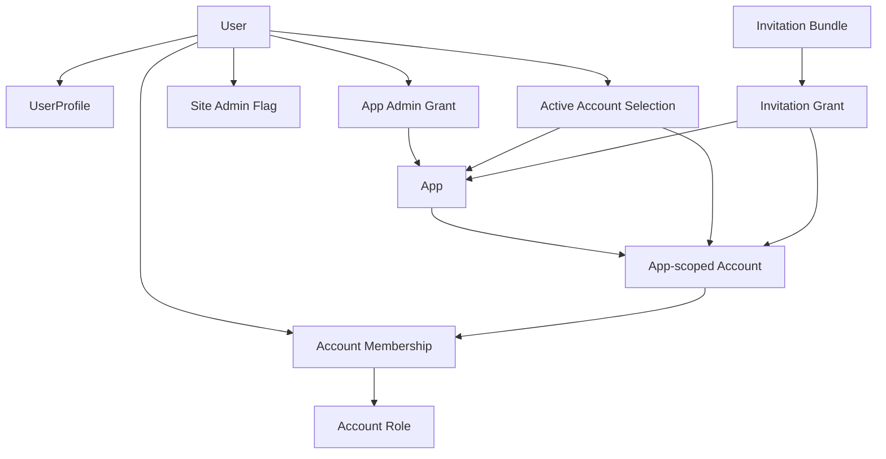
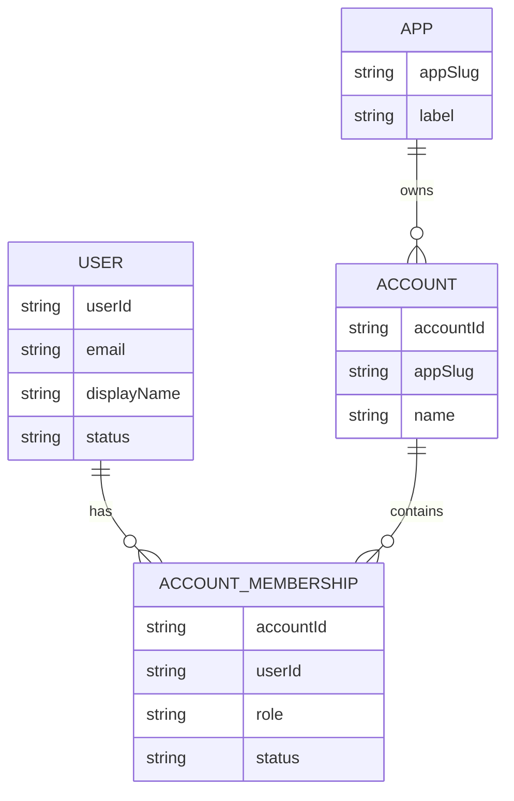
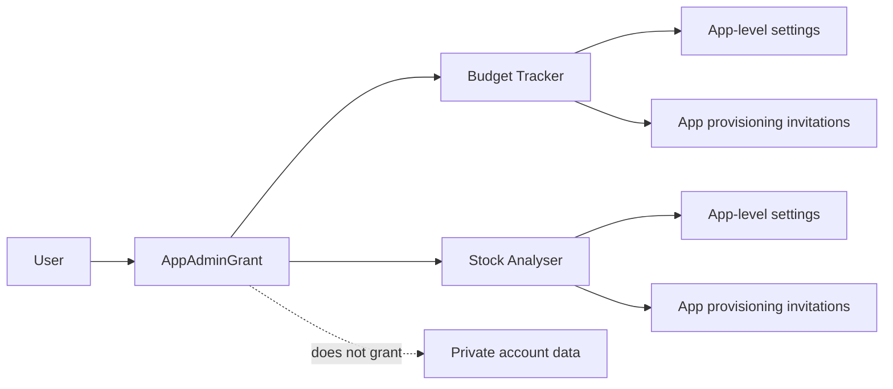
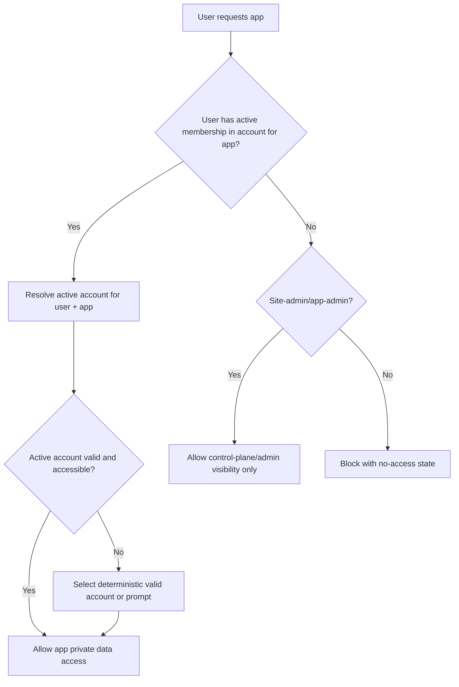
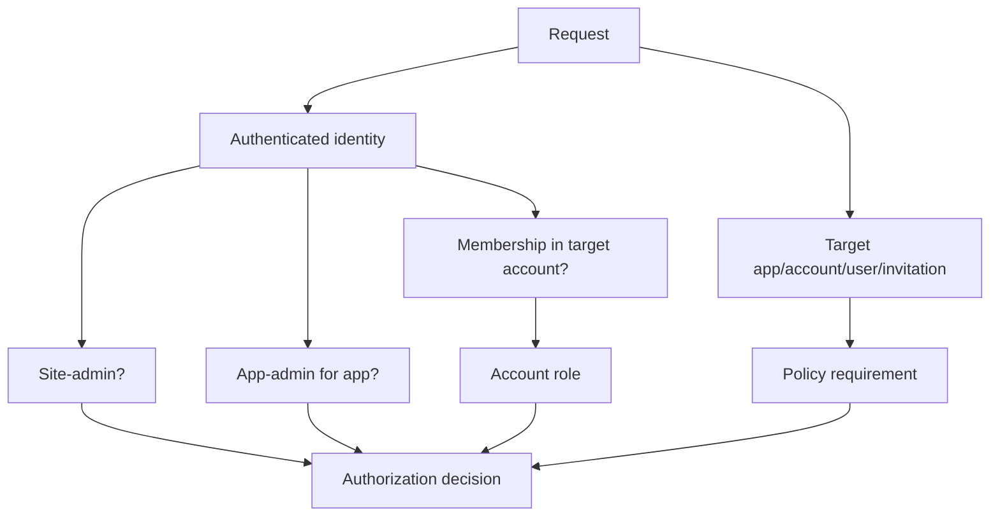
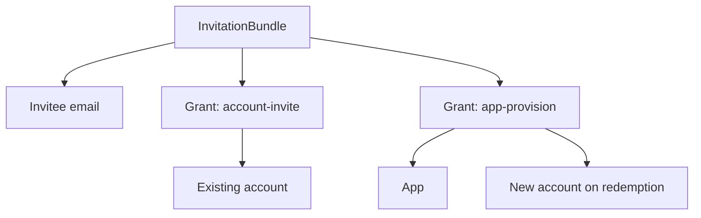
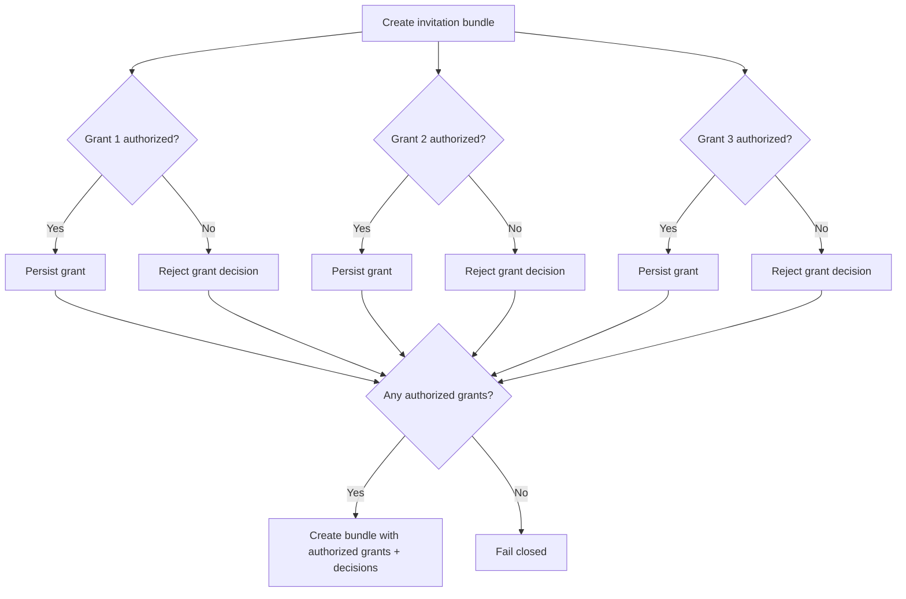
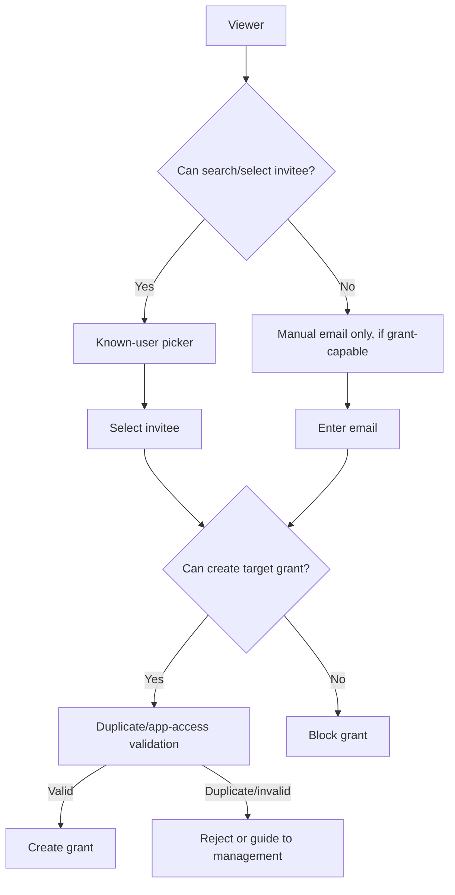
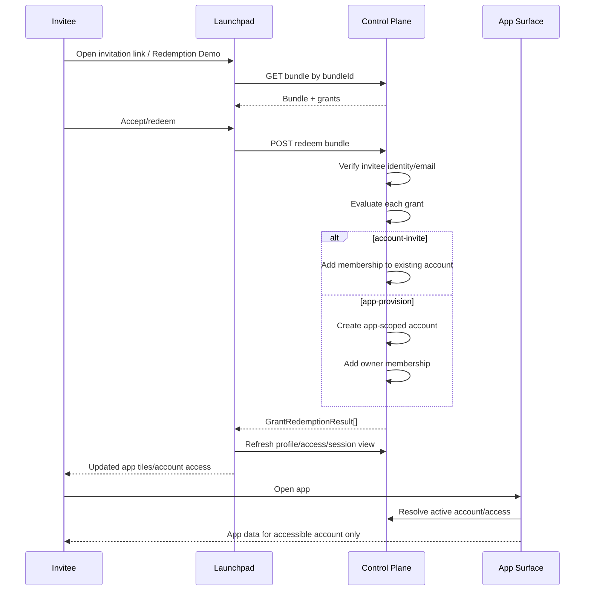
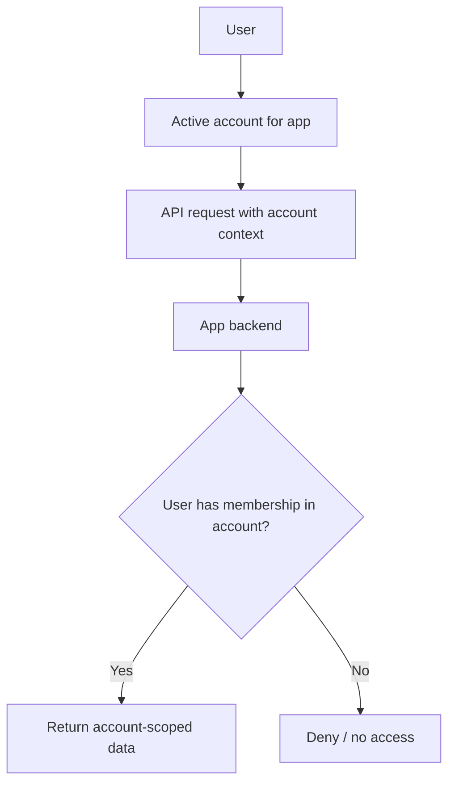

# Transformotion User, Account, and Permissions Model

**Status:** M16 contract-authoritative model, derived from the M11/M16 v0 prototype and contract extraction.  
**Canonical contract baseline:** v0 `m16.0.0`.  
**Runtime status at time of writing:** designed, prototyped, and contracted in v0; runtime sync and implementation still pending.

---

## 1. Executive summary

Transformotion uses a **Launchpad-owned control-plane** model for identity-adjacent application access, accounts, memberships, invitations, profile state, and administrative visibility.

The core rule is:

> **Normal app access is derived from active membership in at least one account for that app.**

This means a user does not simply “have Stock Analyser access” or “have Budget Tracker access” as a standalone entitlement. Instead, the user has one or more **account memberships**, and each account belongs to a specific app.

Examples:

- Steve is a member/owner of a Budget Tracker account, so Steve can use Budget Tracker for that account.
- Liz is invited only to Steve & Liz Household in Budget Tracker, so Liz can see Budget Tracker but not Stock Analyser.
- A user can have multiple accounts in the same app, with different roles per account.
- App-admin and site-admin roles provide control-plane/admin capabilities, but they do not automatically grant private app data access.

Launchpad owns the control-plane. Stock Analyser and Budget Tracker own their app data, but must use Launchpad account/access authority to decide who can enter which app/account context.

---

## 2. Key principles

### 2.1 Launchpad owns the control-plane

Launchpad owns:

- users/profile lifecycle
- app/account/member lifecycle
- invitations and redemption
- app/account access read models
- active account selection per user/app
- site-admin and app-admin control-plane authority
- profile fields such as display name, profile completion, status, and preferences

Stock Analyser and Budget Tracker own:

- their app-specific runtime data
- their own app APIs
- their app-specific domain settings and records
- app data storage keyed by account context

### 2.2 Cognito owns identity; Launchpad owns application profile/access

Cognito remains authoritative for identity fields:

- `sub` / user ID identity
- email identity and verification
- authentication state

Launchpad/control-plane is authoritative for application-facing profile and access state:

- `displayName`
- `profileComplete`
- `status` such as active/disabled
- preferences
- account memberships
- app-admin grants
- active account per app
- invitation lifecycle

### 2.3 App access derives from account membership

A user can enter a normal app data surface only if they have at least one active account membership for that app.

```text
User + membership in app-scoped account => normal app access
No account membership for app          => no normal app access
```

Admin visibility is separate. A site-admin or app-admin may be able to see directory/control-plane information, but that does not grant private app data access.

### 2.4 Accounts are app-scoped

Every account belongs to one app.

An account is not a global Transformotion account shared across all apps. A Budget Tracker account and Stock Analyser account are separate even if they have the same people involved.

```text
Budget Tracker account: Steve & Liz Household
Stock Analyser account: Research Desk
```

### 2.5 Active account is per user per app

A user may belong to multiple accounts in the same app. Therefore the selected/active account must be stored per user and per app.

```text
activeAccount[userId][appSlug] = accountId
```

This avoids stale “first account in token” behaviour and prevents cross-app/account leakage.

---

## 3. Domain model overview



---

## 4. Entities

## 4.1 User

A user represents a person known to Transformotion.

Core identity comes from Cognito, while application-facing profile/access state comes from Launchpad.

Important fields/concepts:

- `userId`
- `email`
- `displayName`
- `profileComplete`
- `status`
- preferences
- site-admin flag or claim
- app-admin grants
- account memberships

### Display name fallback

Display should use a consistent fallback across Launchpad, Stock Analyser, and Budget Tracker:

1. `displayName`
2. email local part, when display name is absent
3. email address
4. generic fallback such as “there” only when needed

This avoids one app showing “Demo User”, another showing an email, and another showing a hard-coded name.

---

## 4.2 App

An app is a Transformotion product surface, such as:

- Launchpad
- Stock Analyser
- Budget Tracker

Apps have app slugs, labels, and app-specific runtime domains.

App access for normal users is not standalone. It is derived from memberships in accounts belonging to that app.

---

## 4.3 Account

An account is an app-scoped collaboration/security boundary.

Important properties:

- `accountId`
- `appSlug`
- account name
- status
- memberships

Examples:

- `Steve & Liz Household` in Budget Tracker
- `Research Desk` in Stock Analyser

A user can be a member of many accounts in one app and different accounts across multiple apps.

---

## 4.4 Account membership

An account membership links a user to an app-scoped account with a role.



Memberships are the basis for:

- app tile visibility
- app entry gates
- app account selectors
- account member management
- access summaries
- app data authorization

---

## 4.5 Account roles

The account role model is:

| Role | Meaning |
|---|---|
| `owner` | Full account control. Can manage roles, invite users, remove users, change account settings, subject to last-owner guard. |
| `manager` | Account management authority short of owner. Can invite/manage allowed roles, but cannot grant owner and cannot bypass last-owner rules. |
| `member` | Normal account user. Can use app data according to app permissions but cannot manage membership. |
| `viewer` | Read-oriented account user where supported. Cannot manage membership. |

### Role rules

- Owners can manage account members, except they cannot remove/demote the last remaining owner.
- Managers can manage users within allowed limits.
- Managers cannot grant `owner`.
- Members/viewers cannot invite or manage account membership.
- Last-owner guard is enforced server-side, not only in UI.

---

## 4.6 Site-admin

A site-admin is a platform-level administrator.

Site-admin can:

- see full user/access directory
- see account/access mappings
- disable users globally
- perform approved supervisory actions
- manage platform-level settings
- create app-provisioning invitations where appropriate

Site-admin does **not** automatically get:

- private app data access
- account membership
- authority to invite users into private accounts unless also owner/manager of that account
- blanket role-management rights inside every account

This is a critical privacy boundary.

---

## 4.7 App-admin

An app-admin has app-scoped administrative authority.

App-admin can:

- administer app-level settings for their app
- see app-scoped users/access summaries where allowed
- create app-provision invitations for their app
- participate in app-level control-plane workflows

App-admin does **not** automatically get:

- private account data access
- account membership
- authority to invite users into private existing accounts unless also owner/manager of that account

App-admin is scoped to one or more apps.



---

## 5. Access model

## 5.1 Normal app access



### Access implications

- Launchpad app tiles should derive from memberships and approved admin surfaces.
- Stock Analyser and Budget Tracker should block private data when the user has no account membership for that app.
- App data requests must be authorized server-side against the selected account.

---

## 5.2 Active account selection

Active account is per user and per app.

Example:

```json
{
  "user-steve": {
    "budget-tracker": "account-bt-household",
    "stock-analyser": "account-sa-apex"
  },
  "user-ava": {
    "stock-analyser": "account-sa-research-desk"
  }
}
```

Rules:

- A user can set active account only to an account they can access.
- Active account selection fails closed if the account does not belong to the app or the user is not a member.
- If active account is stale, runtime should clear it and choose a valid deterministic account or show no-access/selection state.
- Apps should not simply pick the first account from token claims.

---

## 6. Permission model

## 6.1 Permission dimensions

Permissions are evaluated from multiple scoped authorities:



There is no single global “admin can do everything” rule.

Every route/action must evaluate:

- who is the viewer?
- what is the target app/account/user/grant?
- what authority does the viewer have for that target?
- is the action control-plane visibility, private app data access, invitation, role management, or supervisory action?

---

## 6.2 Route auth vs policy auth

The M16 model uses coarse route auth plus fine-grained policy.

Coarse auth examples:

- public
- auth-only
- account
- site-admin

Fine-grained policy examples:

- `app-admin-for-app`
- `account-owner-or-manager`
- `account-member`
- `invitee-only`
- `supervisory-site-admin`
- `canSearchInvitees`
- `canCreateInvitationGrant`
- target-resolved bundle/grant policy

This avoids turning route auth into an overloaded role enum.

---

## 6.3 Policy matrix

| Action | Site-admin | App-admin | Account owner | Account manager | Member | Viewer |
|---|---:|---:|---:|---:|---:|---:|
| View full user/access directory | Yes | App-scoped only | No | No | No | No |
| View users known through managed accounts | Yes | App-scoped | Yes | Yes | No | No |
| Enter private app data | Only if member | Only if member | Yes | Yes | Yes | Usually read-only |
| Invite to existing private account | Only if owner/manager | Only if owner/manager | Yes | Yes, limited | No | No |
| Create app-provision invite | Yes | For administered app | No | No | No | No |
| Change member role | Not by default unless supervisory rule allows | No unless owner/manager | Yes | Limited, no owner grants | No | No |
| Remove member | Supervisory allowed if documented | No unless owner/manager | Yes | Limited | No | No |
| Disable user globally | Yes | No | No | No | No | No |
| Change platform settings | Yes | No | No | No | No | No |
| Change app settings | Yes | Own app | No | No | No | No |
| Change account settings | Only if owner/manager or approved supervisory action | Only if owner/manager | Yes | Yes, if allowed | No | No |

---

## 7. Invitation model

## 7.1 Invitation bundles and grants

The invitation model uses a bundle with one or more independently authorized grants.



A bundle is one invitation/link/email. Each grant inside it is evaluated independently.

Grant kinds:

| Grant kind | Purpose |
|---|---|
| `account-invite` | Add invitee as a member of an existing account. |
| `app-provision` | Create a new account for the invitee in an app and make them owner. |

---

## 7.2 Account-invite grants

Account-invite adds a user to an existing account.

Allowed when:

- sender is owner/manager of the target account
- target role is within sender’s allowed grant range
- invitee is not already a member of the target account
- target account exists and belongs to the specified app

Existing app access does not block account-invite. This allows a user who already has one account in an app to join another account in the same app.

Example:

```text
Liz already has Budget Tracker access through Account A.
Steve invites Liz to Account B.
Allowed, if Steve owns/manages Account B.
After redemption, Liz has two Budget Tracker accounts.
```

---

## 7.3 App-provision grants

App-provision creates a new app-scoped account for the invitee and makes the invitee owner.

Allowed when:

- sender is site-admin or app-admin for the app
- invitee does not already have active access to that app
- target app exists

Blocked when:

- invitee already has active membership in any account for that app

This is intentional. If an existing app user needs access to another account, use `account-invite`, not app-provision.

---

## 7.4 Per-grant authorization and partial acceptance

Grant authorization is independent.



Rules:

- authorized grants proceed
- unauthorized grants are rejected per grant
- if zero grants authorize, bundle creation fails closed
- UI should show which grants were accepted/rejected

---

## 8. Invitee discovery model

Invitee discovery is separate from grant authorization.



### Discovery scopes

| Viewer authority | Known-user search scope |
|---|---|
| Site-admin | all users |
| App-admin | users known through administered app |
| Account owner/manager | people from accounts they own/manage |
| Member/viewer | no invitee search |

Manual email entry remains available to users who can create at least one invitation grant.

### Privacy rule

Manual email entry must not unnecessarily reveal whether the entered email belongs to a registered user unless the viewer has permission to know that.

### Important distinction

Seeing someone in a picker does not mean the viewer can invite that person into any account/app.

Every grant is still authorized independently against the target.

---

## 9. Redemption model

Redemption turns pending grants into memberships/accounts.



### Redemption outcomes

Possible outcomes include:

- accepted
- rejected
- expired
- duplicate
- unauthorized

Redemption should be idempotent. Re-redeeming should not duplicate memberships or accidentally escalate roles.

---

## 10. Settings permissions

Settings follow scope-based ownership.

| Settings scope | Who can edit |
|---|---|
| User settings | the user |
| Account settings | account owner/manager, subject to product rules |
| App settings | site-admin or app-admin for that app |
| Platform settings | site-admin |

Settings scope is a permission concept. It should not be used to invent unapproved settings. The prototype used examples, but canonical runtime should only expose real approved settings.

---

## 11. App data isolation

Stock Analyser and Budget Tracker app data must be scoped by account.



Rules:

- frontend account selectors show only accounts for the current user and app
- app requests carry selected account context
- backend verifies account membership server-side
- app data never falls back to Steve/default/global data
- no-access user gets a clear no-access state

---

## 12. Examples

## 12.1 Liz invited to Budget Tracker only

Initial state:

```text
Liz has no Stock Analyser membership.
Liz has no Budget Tracker membership.
Steve owns/manages Steve & Liz Household in Budget Tracker.
```

Action:

```text
Steve creates account-invite grant for Liz into Steve & Liz Household.
Liz redeems the invite.
```

Result:

```text
Liz sees Budget Tracker tile.
Liz does not see Stock Analyser tile.
Liz can open Budget Tracker for Steve & Liz Household.
Liz cannot open Stock Analyser private data.
```

## 12.2 Existing app user joins another account

Initial state:

```text
Ava is already a member of Stock Analyser Account A.
Steve owns/manages Stock Analyser Account B.
```

Action:

```text
Steve sends account-invite for Ava to Account B.
Ava redeems.
```

Result:

```text
Ava now has two Stock Analyser accounts.
Stock Analyser account selector shows both.
Active account is per user/app.
```

## 12.3 App-provision blocked for existing app user

Initial state:

```text
Ava already has active Stock Analyser access.
A site-admin tries to app-provision Ava into Stock Analyser.
```

Result:

```text
Blocked before sending.
Use account-invite if Ava needs access to another existing account.
```

## 12.4 Site-admin visibility but no private account invite authority

Initial state:

```text
Steve is site-admin.
Steve is not owner/manager of Noah's private account.
```

Action:

```text
Steve tries to invite Liz into Noah's account.
```

Result:

```text
Steve can see users due to site-admin directory authority.
Steve cannot create the account-invite grant because site-admin visibility does not grant private account invitation authority.
```

---

## 13. Runtime implementation implications

The runtime must implement this model in slices.

Recommended order:

1. Sync M16 contracts from v0.
2. Implement profile/access read authority.
3. Implement active account per user/app.
4. Wire Launchpad app tiles to access summaries.
5. Wire SA/BT account selectors and no-access gates.
6. Implement policy helpers.
7. Implement account member management.
8. Implement invitee discovery.
9. Implement invitation bundle create/list/get/cancel.
10. Implement redemption/provisioning.
11. Implement migration/backfill.
12. Deploy to dev and validate end-to-end.

Do not start with invitation redemption. Invitations depend on profile, membership, access summaries, active account, and authorization policy foundations.

---

## 14. Completion criteria

This model is not complete in runtime until all of the following are true:

- M16 contracts are synced into runtime.
- Runtime passes contract freshness checks.
- Launchpad profile/access read APIs return M16-compatible data.
- Active account is per user/app and Launchpad-owned.
- Launchpad app tiles derive from memberships.
- SA and BT app gates enforce account membership.
- SA and BT app data is account-scoped.
- Account member management follows owner/manager/member/viewer rules.
- Invitee discovery respects scoped visibility.
- Invitation bundles support per-grant authorization.
- Redemption creates correct account/membership state.
- Token/session refresh behaviour is documented and implemented where required.
- Existing users/accounts are backfilled or safely defaulted.
- Dev deployment validation passes for the v0-tested scenarios.

---

## 15. Status summary

| Area | Status |
|---|---|
| Product model | Settled |
| v0 prototype | Implemented and user-tested |
| v0 canonical contracts | Merged as `m16.0.0` |
| Runtime contract sync | Pending |
| Runtime implementation | Pending |
| Deployment | Pending |
| Runtime validation | Pending |
